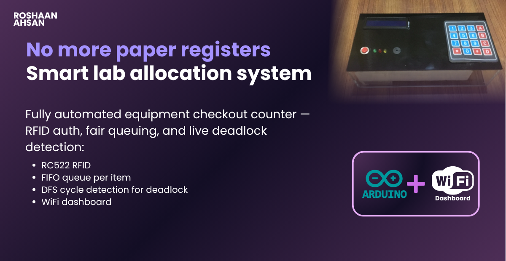
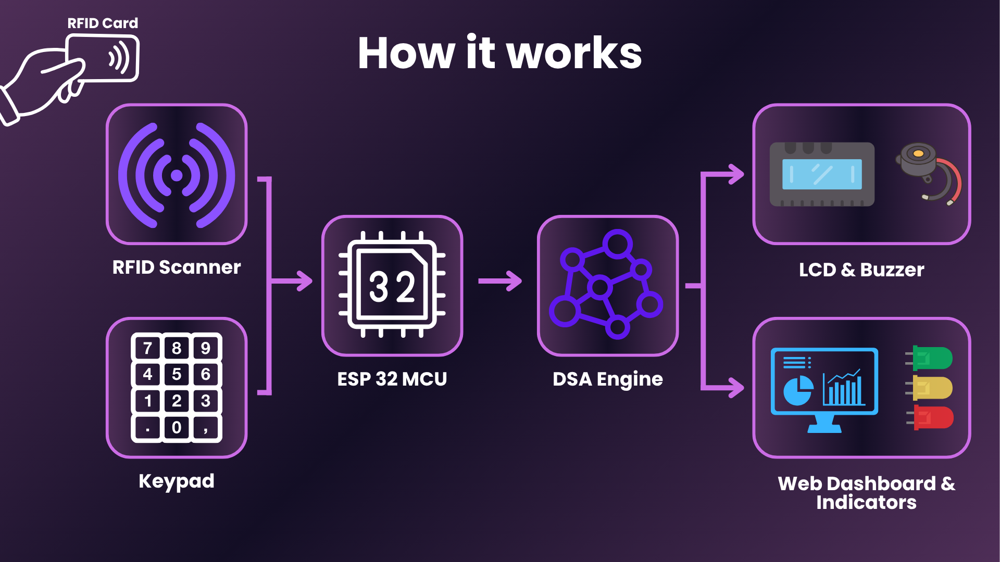
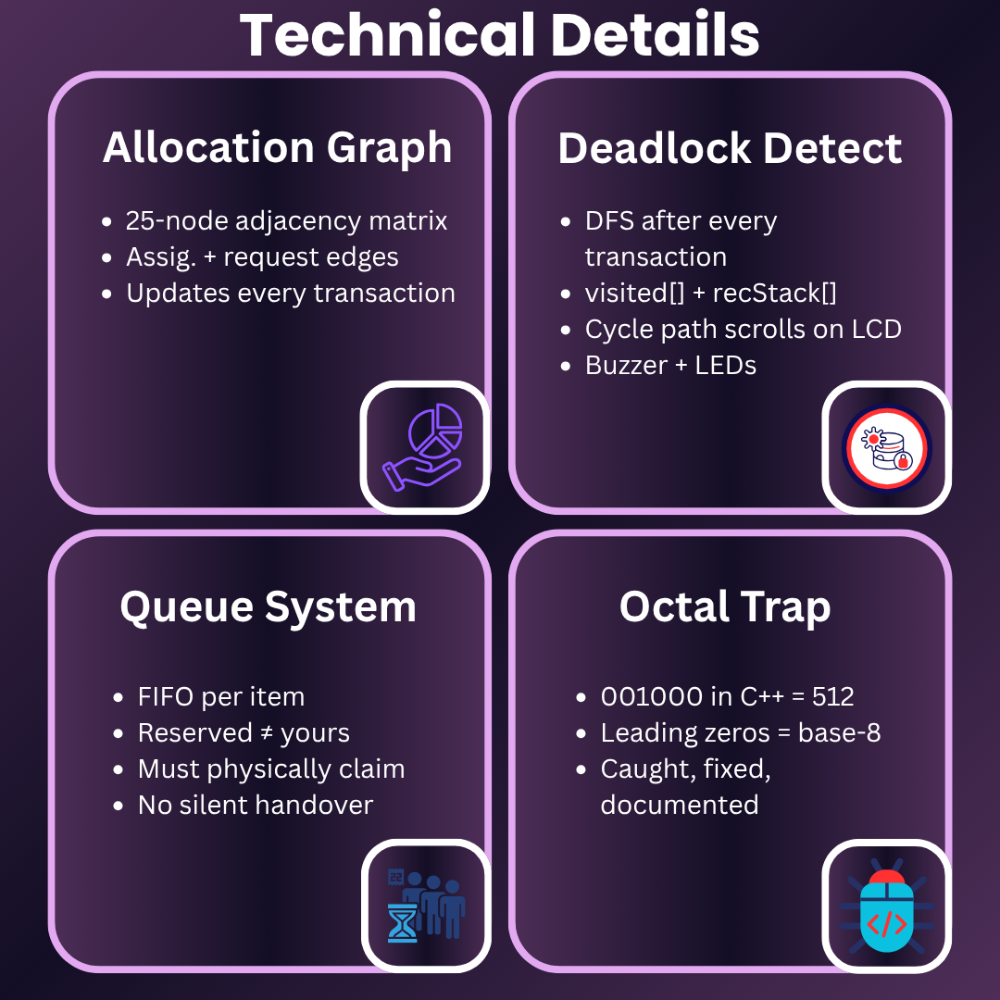
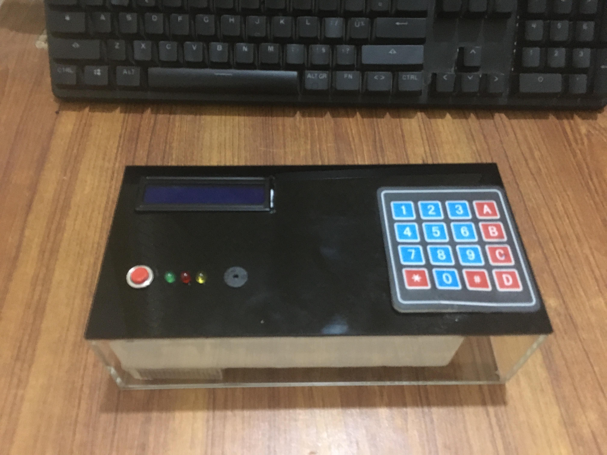
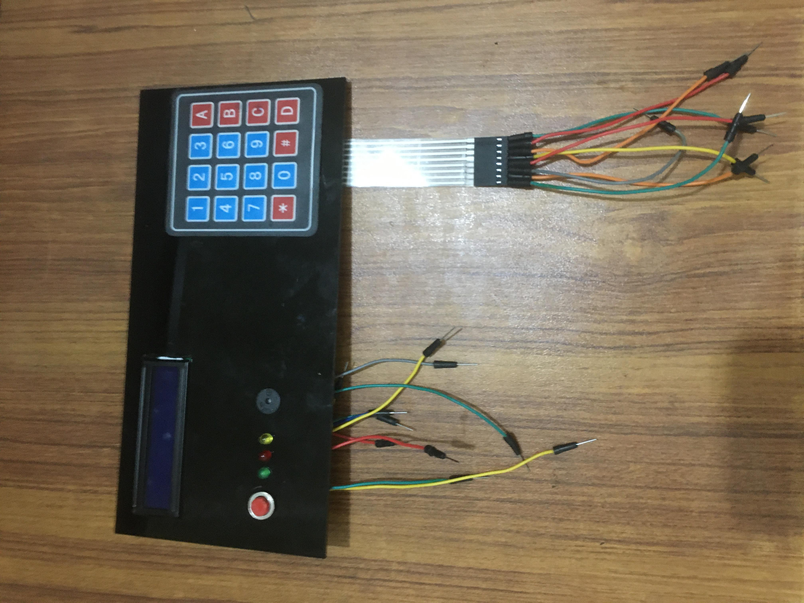
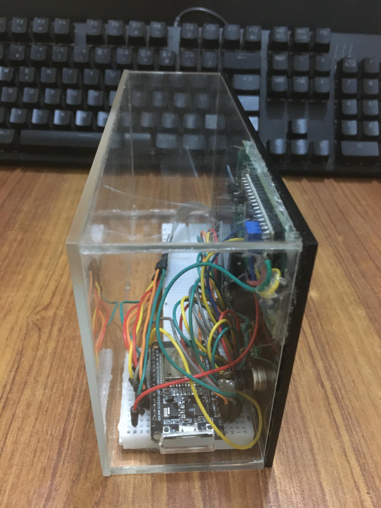
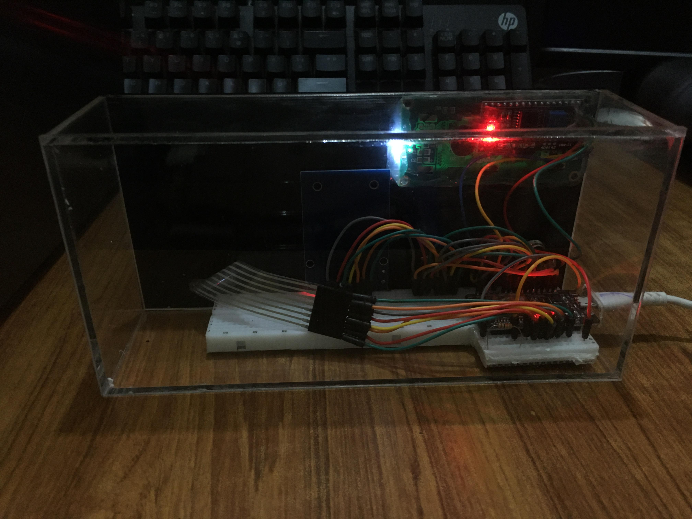
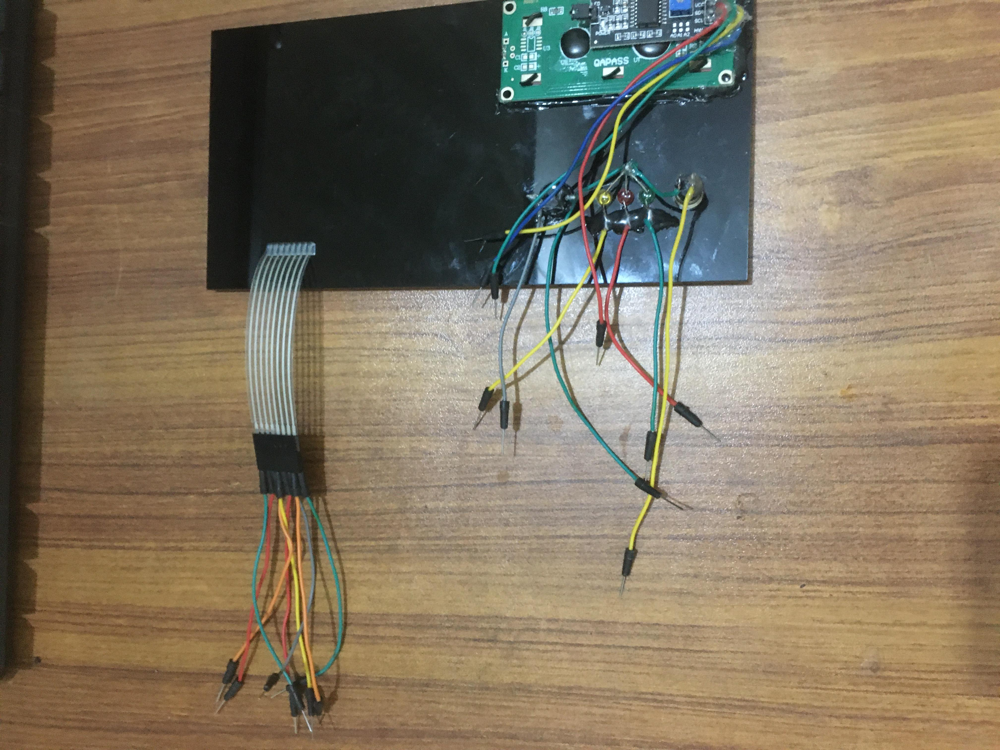
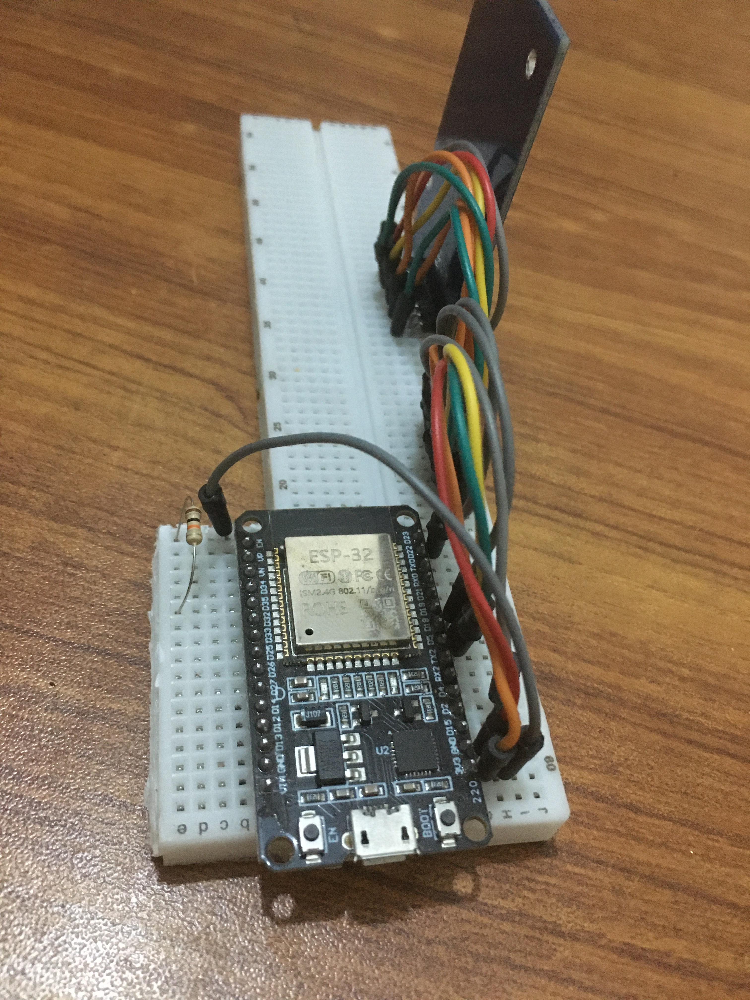
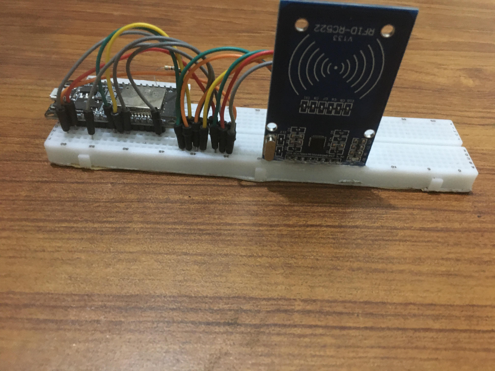

> **A fully automated lab equipment checkout counter — RFID authentication, fair FIFO queuing, and real-time deadlock detection via DFS on a resource-allocation graph. All running on an ESP32.**

---


---


<p align="center">
  
</p>

## Executive Summary

University labs run on paper registers — equipment goes missing, students argue over queues, and nobody detects deadlocks until tempers flare. I engineered a standalone checkout counter on an ESP32 that authenticates students via RFID, manages fair equipment queues in firmware, and runs a DFS cycle-detection algorithm on a live resource-allocation graph after every transaction — surfacing deadlocks on a 16×2 LCD with a buzzer alarm before they become a problem.

---


## System Architecture


<p align="center">
  
</p>

<p align="center">
  
</p>


## The Problem This Solves

| Old Way | This System |
|---|---|
| Paper register — lost, altered, illegible | NVS flash storage — survives power cuts |
| "Who's next?" arguments | FIFO queue per item — enforced in firmware |
| Deadlocks go undetected until conflict | DFS after every transaction — cycle found instantly |
| No visibility into lab state | WiFi dashboard — live status from any device on network |
| Silent handovers — wrong person gets item | Physical presence required to claim reservation |

---

## Technical Stack

### Hardware — Silicon Layer

| Component | Spec | Role |
|---|---|---|
| ESP32 DevKit | 240MHz dual-core, 4MB flash | Brain, web server, NVS storage |
| RC522 RFID | MIFARE Classic, SPI | Student authentication |
| 4×4 Membrane Keypad | GPIO matrix | Serial number entry + navigation |
| 16×2 I²C LCD | 0x27 address | Live system feedback |
| Green / Yellow / Red LEDs | GPIO direct drive | Success / Queued / Deadlock states |
| Active Buzzer | GPIO PWM | Event beeps + deadlock alarm |
| Momentary Push Button | INPUT_PULLDOWN | Full state export to Serial |

### Firmware


Custom state machine with 11 UI states, debounced keypad handling, 15-second idle timeout, and full graph rebuild on every borrow/return/queue event.

### WiFi Layer


Runs in AP mode (SSID: `LabSystem`) by default. Any device on the network can view live equipment status, download a CSV report, or inspect the raw resource-allocation graph as text.

---

## Engineering Deep Dive

### The Resource-Allocation Graph

The core data structure is a `graph[25][25]` adjacency matrix where nodes `0–9` represent students and nodes `10–24` represent equipment items.

- **Assignment edge**: `Equipment → Student` (item is held by that student)
- **Request edge**: `Student → Equipment` (student is waiting for that item)

Every borrow, return, and queue operation mutates this graph. DFS runs immediately after.

### DFS Cycle Detection

```cpp
bool dfsCycleDetect(int v, bool* visited, bool* recStack, int* path, int* pathLen) {
  visited[v] = true; recStack[v] = true;
  path[(*pathLen)++] = v;
  for (int u = 0; u < MAX_NODES; u++) {
    if (graph[v][u] == 0) continue;
    if (!visited[u]) {
      if (dfsCycleDetect(u, visited, recStack, path, pathLen)) return true;
    } else if (recStack[u]) {
      path[(*pathLen)++] = u; // back-edge found → deadlock
      return true;
    }
  }
  recStack[v] = false; (*pathLen)--;
  return false;
}
```

When a cycle is found, the path is extracted and scrolled across the LCD — e.g. `05→000000→18→001000→05` — while the red LED fires and the buzzer alarms.

### The Real-World Queue Logic

Unlike academic examples, this system never silently hands over equipment. When a student returns an item and someone is queued, the LCD shows `Next: Student1` — but Azaz must physically scan his card and press `A` to claim it. A third student attempting to borrow the reserved item is rejected: `Reserved for Student1`. This prevents phantom assignments.

### The Octal Trap

Equipment serials were originally written as `001000`, `001001` in C/C++. A leading `0` means **octal (base-8)**. `001000` (octal) = `512` decimal — not `1000`. The system was silently mis-routing equipment lookups. Fix: store serials as plain integers, display with `%06d` format.

---

## Features

- **RFID Authentication** — MIFARE Classic cards, UID-based student lookup
- **FIFO Queue per Item** — circular array, position displayed on LCD
- **Live Deadlock Detection** — DFS cycle detection after every transaction
- **16×2 LCD State Machine** — 11 UI states, idle timeout, scrolling alerts
- **NVS Persistent Storage** — students and equipment survive power cuts
- **WiFi Dashboard** — live HTML status page, JSON API, CSV export
- **LED + Buzzer Feedback** — green/yellow/red per transaction outcome
- **Serial Export Button** — full system state dump on demand
- **Admin Registration** — new RFID cards registered live via keypad

---

## Hardware Gallery

<p align="center">
  
  
</p>

<p align="center">
  
  
</p>

<p align="center">
  
  
</p>

<p align="center">
  
</p>

---

## Demo

> 📹 Demo video avalible on Linkidin & X — full walkthrough showing RFID scan, queue, deadlock trigger, LCD scroll, WiFi dashboard, and CSV export.

**Demonstration sequence:**
1. Boot — LCD alternates `System Ready!` with IP address
2. Roshaan scans → borrows Oscilloscope `000000` → green LED
3. Azaz scans → same item → yellow LED, queued
4. Roshaan returns → LCD: `Next: Student1`
5. Azaz claims reserved item → green LED
6. Deadlock created → red LED + buzzer + scrolling path `05→000000→18→001000→05`
7. Admin registers new card + web dashboard accessed from phone

---

## Project Context

Built in 2026. Published as part of my engineering portfolio. The goal was to take DSA theory — graphs, queues, cycle detection — off the whiteboard and run it on real hardware solving a genuine problem.

---

## Contact

[](mailto:roshaanahsan.pro@gmail.com)
[](https://linkedin.com/in/roshaanahsan)
[](https://github.com/roshaanahsan)
[](https://x.com/roshaanahsan)
